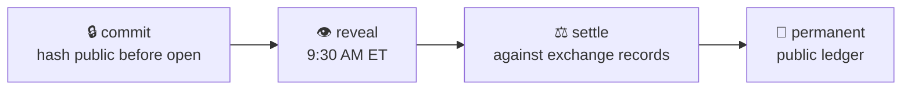

# QuantRank500

**A public record of stock predictions, settled by the market itself.**

*Est. 2026 · Tampa, FL*

---

Predictions are locked with a cryptographic commitment before the market
opens, revealed at 9:30 AM ET, and settled automatically against exchange
trade records. No self-reported results — wins, losses, and entries the
market never reached all stay on the record, forever. Everyone competes
with the same simulated **$500 account**.

> Trust lives on the write path. Engagement lives on the read path.

The write path is INSERT-only and hash-chained; every event links to the one
before it, so the record can be verified end-to-end by anyone. Everything you
*see* — balances, rankings, statistics — is recomputed from that ledger and
never stored, never edited.

|  |  |
|---|---|
| 🔴 Live demo | [demo.quantrank500.com](https://demo.quantrank500.com) — full platform, real market data, nightly settlement |
| 🏠 Site | [quantrank500.com](https://quantrank500.com) |
| 📖 API reference | [demo.quantrank500.com/api/docs](https://demo.quantrank500.com/api/docs) |
| 📊 Traffic | [public dashboard](https://analytics.quantrank500.com/share/qr500demo/demo.quantrank500.com) — even our visitor counts are auditable |

**What we refuse to build:** accounts, emails, notifications, ads, data
sales, comments, badges, follower counts. A public record. Nothing more.

**Licensing:** code MIT · published ledger data CC0 (public domain).
The platform code opens with the public launch.

*A record of predictions, not investment advice.*

